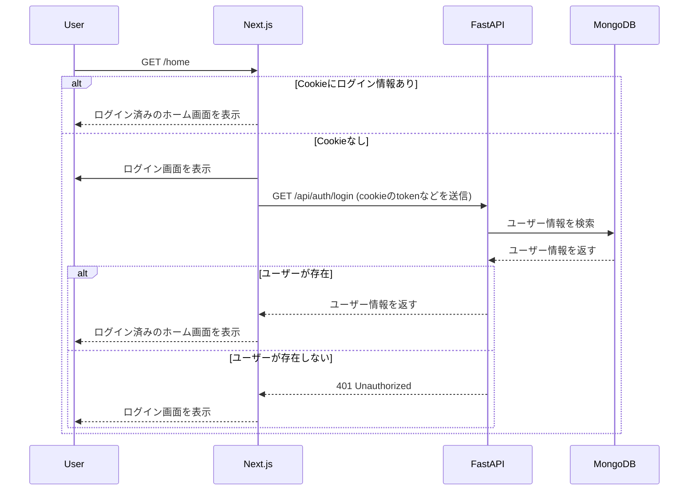
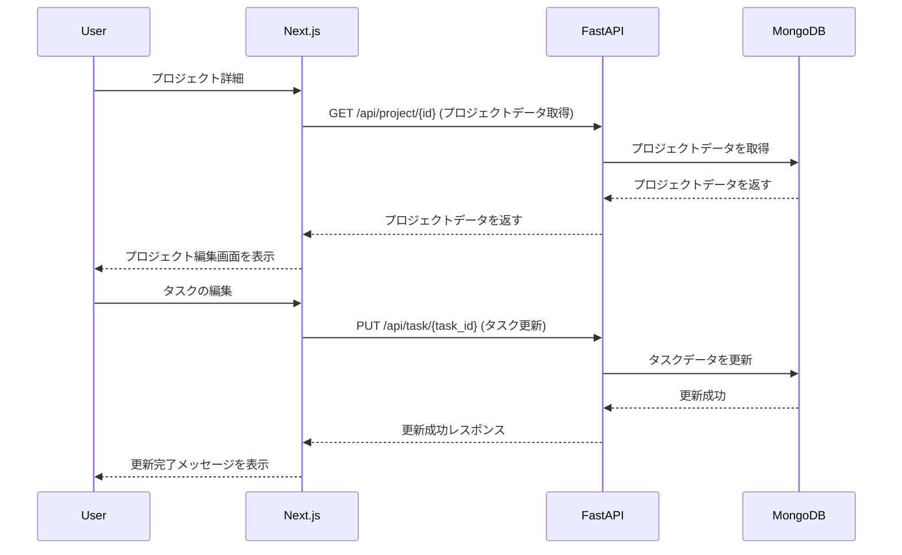
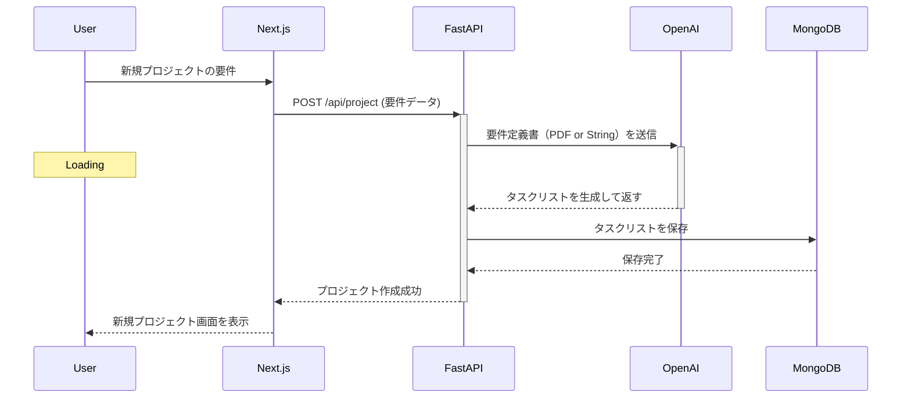
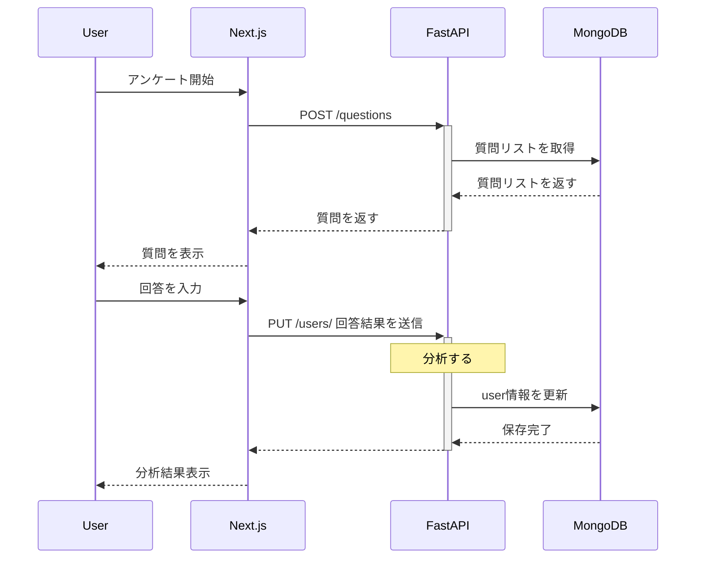

## home

```mermaid
sequenceDiagram
    participant User
    participant Next.js
    participant FastAPI
    participant MongoDB

    User->>Next.js: GET /home
    alt Cookieにログイン情報あり
        Next.js-->>User: ログイン済みのホーム画面を表示
    else Cookieなし
        Next.js->>User: ログイン画面を表示
        Next.js->>FastAPI: GET /api/auth/login (cookieのtokenなどを送信)
        FastAPI->>MongoDB: ユーザー情報を検索
        MongoDB-->>FastAPI: ユーザー情報を返す
        alt ユーザーが存在
            FastAPI-->>Next.js: ユーザー情報を返す
            Next.js-->>User: ログイン済みのホーム画面を表示
        else ユーザーが存在しない
            FastAPI-->>Next.js: 401 Unauthorized
            Next.js-->>User: ログイン画面を表示
        end
    end
```

## project編集

```mermaid
sequenceDiagram
    participant User
    participant Next.js
    participant FastAPI
    participant MongoDB

    User->>Next.js: プロジェクト詳細
    Next.js->>FastAPI: GET /api/project/{id} (プロジェクトデータ取得)
    FastAPI->>MongoDB: プロジェクトデータを取得
    MongoDB-->>FastAPI: プロジェクトデータを返す
    FastAPI-->>Next.js: プロジェクトデータを返す
    Next.js-->>User: プロジェクト編集画面を表示

    User->>Next.js: タスクの編集
    Next.js->>FastAPI: PUT /api/task/{task_id} (タスク更新)
    FastAPI->>MongoDB: タスクデータを更新
    MongoDB-->>FastAPI: 更新成功
    FastAPI-->>Next.js: 更新成功レスポンス
    Next.js-->>User: 更新完了メッセージを表示
```

## project作成

```mermaid
sequenceDiagram
    participant User
    participant Next.js
    participant FastAPI
    participant OpenAI
    participant MongoDB

    User->>Next.js: 新規プロジェクトの要件
    Next.js->>+FastAPI: POST /api/project (要件データ)
    FastAPI->>+OpenAI: 要件定義書（PDF or String）を送信
    Note over User: Loading
    OpenAI-->>-FastAPI: タスクリストを生成して返す
    FastAPI->>MongoDB: タスクリストを保存
    MongoDB-->>FastAPI: 保存完了
    FastAPI-->>-Next.js: プロジェクト作成成功
    Next.js-->>User: 新規プロジェクト画面を表示

```

## アンケート

```mermaid
sequenceDiagram
    participant User
    participant Next.js
    participant FastAPI
    participant MongoDB

    %% --- アンケート開始 ---
    User->>Next.js: アンケート開始
    Next.js->>+FastAPI: POST /questions
    FastAPI->>MongoDB: 質問リストを取得
    MongoDB-->>FastAPI: 質問リストを返す
    FastAPI-->>-Next.js: 質問を返す
    Next.js-->>User: 質問を表示

    User->>Next.js: 回答を入力
    Next.js->>+FastAPI: PUT /users/ 回答結果を送信
    Note over FastAPI: 分析する
    FastAPI->>MongoDB: user情報を更新
    MongoDB-->>FastAPI: 保存完了
    FastAPI-->>-Next.js:　
    Next.js-->>User: 分析結果表示
```
