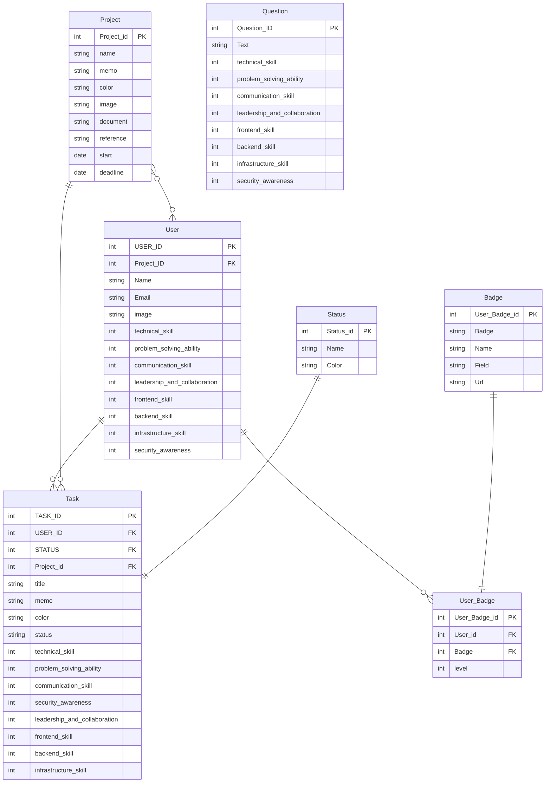

```sh
pip install --no-cache-dir -r requirements.txt
gunicorn -w 4 -k uvicorn.workers.UvicornWorker main:app
```



# API Endpoints by Resource Type

## Authentication

| Priority | Method | Endpoint      | Description |
| -------- | ------ | ------------- | ----------- |
| 3        | POST   | /auth/signin  | Sign in     |
| 3        | POST   | /auth/signout | Sign out    |
| 3        | POST   | /auth/signup  | Sign up     |

## Users

| Priority | Method | Endpoint                  | Description                                      |
| -------- | ------ | ------------------------- | ------------------------------------------------ |
| 1        | POST   | /users                    | Add a new user                                   |
| 1        | GET    | /users/{users_id}         | Get user details. Return 404 if not current_user |
| 4        | PUT    | /users/{users_id}         | Update user information (name, email)            |
| 4        | DELETE | /users/{users_id}         | Not implemented                                  |
| 3        | GET    | /users/{users_id}/project | Get list of projectthe user belongs to           |
| 5        | GET    | /users/{users_id}/tasks   | Get list of tasks linked to a user               |
| 5        | GET    | /users/badges             | Get user badges                                  |

## Projects

| Priority | Method | Endpoint                              | Description                                                     |
| -------- | ------ | ------------------------------------- | --------------------------------------------------------------- |
| 3        | POST   | /project                              | Add a new project                                               |
| 3        | GET    | /project/{project_id}                 | Get project details. Return 404 if not current_user's project   |
| 3        | PUT    | /project/{project_id}                 | Update project information (development period, deadline, etc.) |
| 5        | DELETE | /users/{user_id}/project/{project_id} | User leaves a project                                           |
| 5        | DELETE | /project/{project_id}/users/{user_id} | Admin removes a user from project                               |
| 3        | GET    | /project/{project_id}/tasks           | Get list of tasks for a project                                 |

## Tasks

| Priority | Method | Endpoint                    | Description              |
| -------- | ------ | --------------------------- | ------------------------ |
| 3        | GET    | /tasks                      | GET all tasks            |
| 3        | GET    | /tasks/{task_id}            | GET a task               |
| 3        | POST   | /tasks                      | Add a task               |
| 4        | PUT    | /tasks                      | Update a task            |
| 4        | GET    | /tasks/project/{project_id} | tasks related to project |
| 4        | GET    | /tasks/user/{user_id}       | tasks related to user    |

## Questions

| Priority | Method | Endpoint   | Description       |
| -------- | ------ | ---------- | ----------------- |
| 2        | GET    | /questions | Get all questions |

## Badges

| Priority | Method | Endpoint            | Description            |
| -------- | ------ | ------------------- | ---------------------- |
| 5        | GET    | /badges             | Get list of all badges |
| 5        | GET    | /badges/{badges_id} | Get badge details      |
